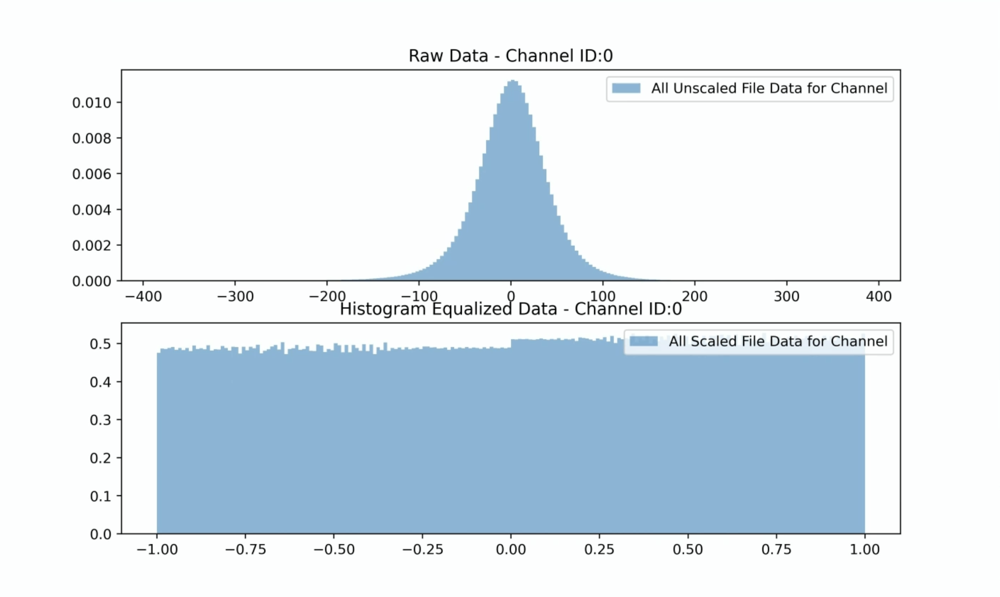
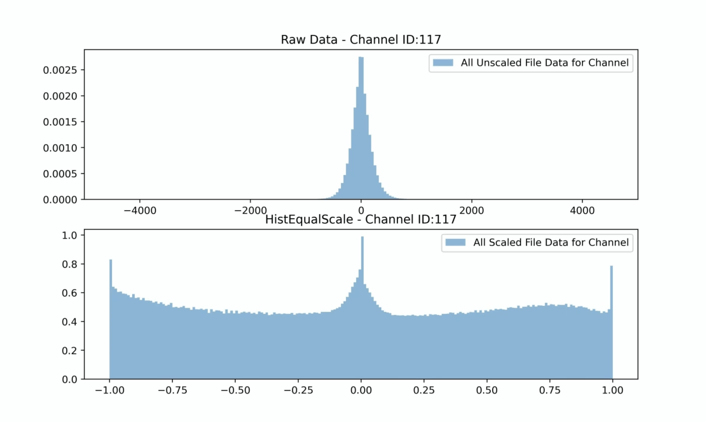
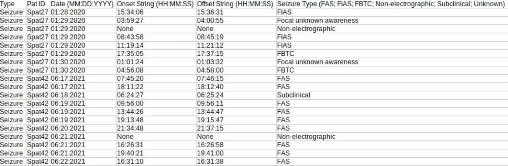

# Kenaz Large Brain-State Model (KenazLBM)

Welcome to the step-by-step guide for installing and using KenazLBM on raw intracranial EEG data.

> **Assumptions:**  
> This guide is written for Ubuntu 22.04 with Nvidia GPUs. Compatibility with other systems is not guaranteed.

KenazLBM documentation is based on this [GitHub repository](https://github.com/grahamwjohnson/KenazLBM).

---

## Installation

### 1. Install Conda

Follow the [Anaconda installation instructions](https://www.anaconda.com/docs/getting-started/anaconda/install) to install Anaconda3.

### 2. Install KenazLBM

After installing Conda, create the KenazLBM environment:

```bash
conda env create -f https://raw.githubusercontent.com/grahamwjohnson/KenazLBM/main/environment.yml
```

---

## Model Usage

### Option 1: Command-Line Interface

Activate the Conda environment:

```bash
conda activate lbm_env
```

#### **File Format Assumptions**
- All files are `.EDF` format.
- Sampling frequency is 512 Hz or a multiple of 512 Hz.
- File names must be formatted as:  
  `subjectid_MMDDYYYY_HHMMSSSS`  
  Example: `Epat27_02182020_17072099` (where `SSSS` is seconds and centiseconds)

#### **Directory Structure Assumptions**
```bash
parent_dir/
    subject_id_0/
        <file0_named_as_above>.EDF
        <file1_named_as_above>.EDF
        ...
    subject_id_1/
        <file0_named_as_above>.EDF
        <file1_named_as_above>.EDF
        ...
```
> All preprocessing and model runs will be conducted in the same directory.

---

### Step 1: Preprocessing

Preprocess your data (default equalization uses first 24 hours):

```bash
kenazlbm preprocess --input /path/to/parent_dir --eq_hrs 24
```

**After preprocessing, your directory will look like:**
```bash
parent_dir/
    subject_id_0/
        metadata/
            scaling_metadata/
                histo_bin_counts.pkl
                linear_interpolations_by_channel.pkl
                normalization_epoch_seconds.pkl
            ...bipolar_montage_names_and_indexes_from_rawEDF.csv # Just for reference
        preprocessed_epoched_data
            metadata
                normalization_histograms
                    <file0_dir>
                    <file1_dir>
                    ...
                    JPEG
                        ...jpg # Visualize the equalization
                    SVG # Same as JPEGs
                zero_padded_epochs
                    ....pkl # Any files that have a large number of 0 values will be detected and saved here
                            # The reason is that many .EDF export systems will zero-pad gaps in recordings
            ...pkl  # These are the equalized data epoched to 1024 seconds
            ...pkl
            ...pkl
        <file0_named_as_above>.EDF # original files
        <file0_named_as_above>_bipole_filtered.pkl  # This is before equalization
        <file1_named_as_above>.EDF # original files
        <file1_named_as_above>_bipole_filtered.pkl  # This is before equalization
    subject_id_1
    ...
```

**Troubleshooting:**  
This step is computationally intensive and may crash/hang.  
You can restart at various checkpoints using the `--checkpoint` option:
- `0`: Start from scratch
- `1`: Start after bipole montage/filtering (`...bipole_filtered.pkl` files exist)
- `2`: Start after equalization scheme (`linear_interpolations_by_channel.pkl` exists)

**Examples:**
```bash
kenazlbm preprocess --input /path/to/parent_dir --eq_hrs 24 --checkpoint 1
kenazlbm preprocess --input /path/to/parent_dir --eq_hrs 24 --checkpoint 2
```

**Visualization:**  
Use `seeg_epoch_explorer.py` to view `.pkl` files after preprocessing.

The equalization histograms are helpful to visualize how the signal was transformed. A histogram for a channel that was used in the equalization calculation should look similar to this:


A histogram for an epoch not used in the equalization calculation may look slightly different due to drift in the signal characteristics over time (i.e. these data were later in the data and not used in equalization calculation). This is ok. 


### Step 2: Prefetch Pretrained Models

Download pretrained models:

```bash
kenazlbm prefetch_models
```

The BSE, BSP, and BSV pretrained models should now be downloaded and cached locally in your conda environment directory. To check, you can run the following command:

```bash
kenazlbm check_models
```

**Expected output:**
```text
bse_weights.pth: FOUND (1021.75 MB)
disc_weights.pth: FOUND (58.57 MB)
bsp_weights.pth: FOUND (1600.60 MB)
bsv_weights.pth: FOUND (5.29 MB)
som_file.pth: ONLINE (not cached locally)
som_axis_file.pkl: ONLINE (not cached locally)
```
> The two SOM files are not cached locally.

---

### Step 3: Running the Brain-State Embedder (BSE)

To run the preprocessed data through the models, we can now call the following:

```bash
kenazlbm run_bse --input '/path/to/parent_dir'
```
---

This will look for the **'parent_dir/subject_id/preprocessed_epoched_data'** directory and run all .pkl files in the directory through the following:

Preprocessed .pkl files --> BSE --> BSV            # These outputs will be saved in 'bsev' directory


### Step 4: Running the Self-Organizing Map (SOM) aka Kohonen Map

Now that you have outputs from the BSV, you can project them onto the SOM with the following command. All pre-ictal periods from 4 hours before any seisure will be colored if a atd_file.csv is provided with timestamps fro seizures. 

```bash
kenazlbm run_som --input '/path/to/parent_dir' --atd_file '/path/to/atd_file.csv'
```


NOTE: You must provide the path to your own atd_file.csv (or the example file will be used). The format is as follows, must use exact header labels.



---

### Option 2: Python Scripts

To have more granular control of the model usage, get intermediate outputs like full size 1024-dimensional embeddings from the BSE, or forecast future emebeddings with the BSP, you can interact with the models directly in a python script as follows:


