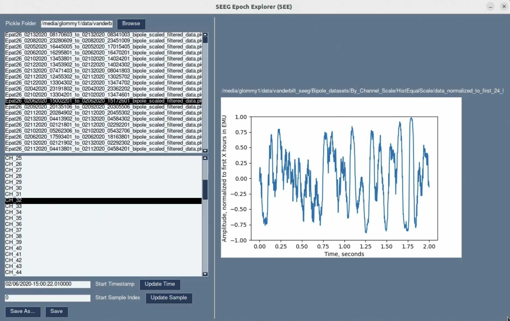

# Kenaz Large Brain-State Model (KenazLBM)

This is the step-by-step guide on how to install and use KenazLBM on raw intracranial EEG data. 

Assumptions: This guide is made on OS Ubuntu 22.04 with Nvidia GPUs, cannot guarentee any other compatability. 

This ReadTheDocs is based on the GitHub repository: https://github.com/grahamwjohnson/KenazLBM


# Installation

## Conda Install

Follow directions at: https://www.anaconda.com/docs/getting-started/anaconda/install to install Anaconda3

## KenazLBM Installation

After conda is installed, install **KenazLBM** with following line:

```bash
conda env create -f https://raw.githubusercontent.com/grahamwjohnson/KenazLBM/main/environment.yml
```


# A: Model Usage

## A.1: Option 1 - Running Command-line Interface with KenazLBM Models

The 'kenazlbm' package can now be used within the conda 'lbm_env' environment. 

IMPORTANT: File Format Assumptions: 
1) All files are .EDF format
2) Sampling frequency is 512 Hz or is multiple of 512 Hz
3) File name must be formatted as: 'subjectid_MMDDYYY_HHMMSSSS' where SSSS is seconds and deciseconds: Example is "Epat27_02182020_17072099"

IMPORTANT: Directory structure assumptions:
```bash
parent_dir
    subject_id_0
        <file0_named_as_above>.EDF
        <file1_named_as_above>.EDF
        ...
    subject_id_1
        <file0_named_as_above>.EDF
        <file1_named_as_above>.EDF
        ...
```
    
NOTE: All preprocessing and model runs will be conducted in same directory.


### A.1.1: Activate Conda Environment 

```bash
conda activate lbm_env
```


### A.1.2: Preprocessing

The first step is to preprocess your data. This command will filter the data and histogram equalize it to prepare for input to the BSE. The zero-centered histogram equalization (ZHE) scheme looks at the first 24 hours (default) present in your files (missing data included in time calculation), then applies the calculated equalization scheme to all data. To change the hours used for equalization calculation, pass in a different value for '24' below. Preprocessing may take multiple minutes per file for large EDF files (e.g. 5-10 GB) depending on CPU and RAM resources. 

```bash
kenazlbm preprocess --input /path/to/parent_dir --eq_hrs 24
```

After preprocessing, directory structure will look as follows:

```bash
parent_dir
    subject_id_0
        metadata
            scaling_metadata
                histo_bin_counts.pkl # Just for reference
                linear_interpolations_by_channel.pkl # Equalization scheme calculations from X hours of data, then used for all data
                normalization_epoch_seconds.pkl
            ...bipolar_montage_names_and_indexes_from_rawEDF.csv # Just for reference
        preprocessed_epoched_data
            metadata
                normalization_histograms
                    <file0_dir>
                    <file1_dir>
                    ...
                    JPEG
                        ...jpg # Visualize the equalization
                    SVG # Same as JPEGs
                zero_padded_epochs
                    ....pkl # Any files that have a large number of 0 values will be detected and saved here
                            # The reason is that many .EDF export systems will zero-pad gaps in recordings
            ...pkl  # These are the equalized data epoched to 1024 seconds
            ...pkl
            ...pkl
        <file0_named_as_above>.EDF # original files
        <file0_named_as_above>_bipole_filtered.pkl  # This is before equalization
        <file1_named_as_above>.EDF # original files
        <file1_named_as_above>_bipole_filtered.pkl  # This is before equalization
    subject_id_1
    ...
```

Troubleshooting: this script is computational intensive and may crash/hang. Can restart the script at various checkpoints using the '--checkpoint' option, where '0' is default and will start preprocessing from start, '1' is after and bipole montage and filtering (i.e. the '...bipole_filtered.pkl' files have already been made), '2' is after equalization scheme has been aquired (i.e. the 'linear_interpolations_by_channel.pkl' file has been made) 

Example preprocessing call to start preprocessing with '...bipole_filtered.pkl' files already made
```bash
kenazlbm preprocess --input /path/to/parent_dir --eq_hrs 24 --checkpoint 1
```

Example preprocessing call to start preprocessing with '...bipole_filtered.pkl' files AND 'metadata/scaling_metadata/linear_interpolations_by_channel.pkl' file already made
```bash
kenazlbm preprocess --input /path/to/parent_dir --eq_hrs 24 --checkpoint 2
```

To visualize the preprocessed files, you can use the 'seeg_epoch_explorer.py' which provides a GUI to view .pkl files after preprocessing. 


The equalization histograms are helpful to visualize how the signal was transformed. A histogram for a channel that was used in the equalization calculation should look similar to this:


A histogram for an epoch not used in the time series may look slightly different due to drift in the signal characteristics over time (i.e. these data were later in the data and not used in equalization calculation). This is ok. 


### A.1.3: Prefetch Pretrained Models

Next we will obtain the pretrained models from Torchhub/Github

```bash
kenazlbm prefetch_models
```

The BSE, BSP, and BSV pretrained models should now be downloaded and cached locally. To check, you can run the following command:

```bash
kenazlbm check_models
```

The output should look like:
```bash
bse_weights.pth: FOUND (1021.75 MB)
disc_weights.pth: FOUND (58.57 MB)
bsp_weights.pth: FOUND (1600.60 MB)
bsv_weights.pth: FOUND (5.29 MB)
som_file.pth: ONLINE (not cached locally)
som_axis_file.pkl: ONLINE (not cached locally)
```
Note that the 2 self-organizing map (SOM) files are not cached locally


### A.1.4: Running the BSE


### A.1.5: Running the BSP


## A.2: Option 2 - Running KenazLBM Models With Python Scripts


